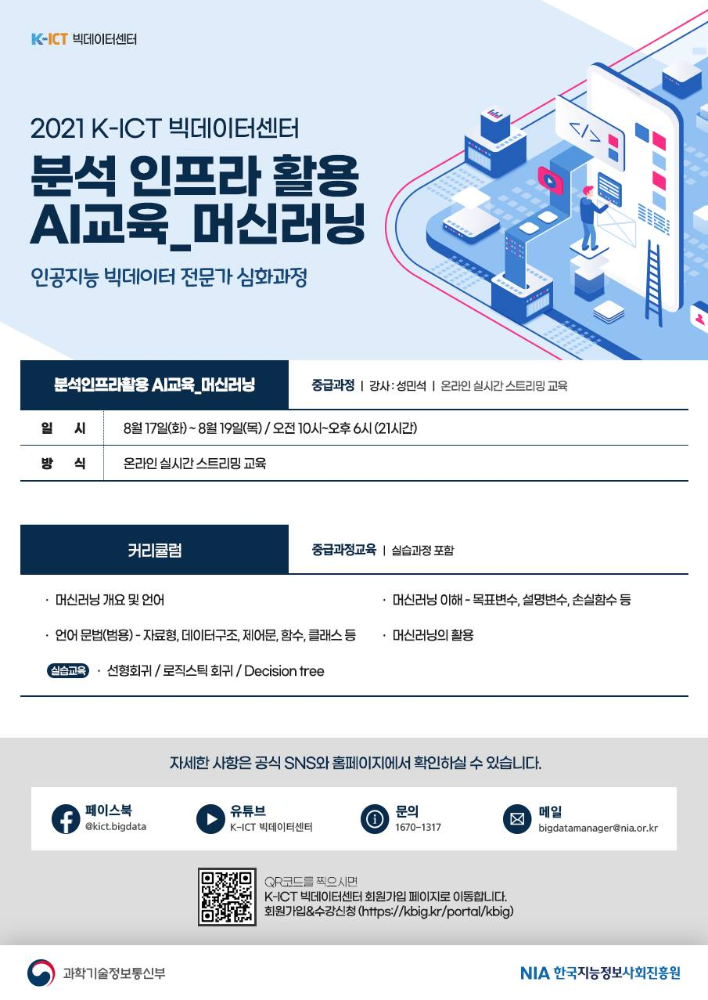

# 2021 K-ICT 빅데이터센터 : 분석 인프라 활용 AI교육 머신러닝

 

## 수강 대상
본 강의는 인공지능 관련하여 관심 있는 일반인 50명을 대상으로 온라인교육으로 진행됩니다.   
본 강의는 파이썬에 대한 기초 지식이 없는 수강생에게는 다소 어려울 수 있습니다. 이 점 양해 부탁드립니다.

 

## 교육 일시 및 장소
본 강의는 `2021.8.17(화)~19(목)`으로 `3일간` 진행됩니다. 각 일자별로 `오전 10시 ~ 오후 6시까지(총 21시간)`로 진행됩니다. 본 교육은 [판교 스타트업캠퍼스 1동 6층](http://kko.to/ZorLrT4fH)에 소재한 빅데이터센터 교육장에서 강의(온라인)가 진행됩니다. 

 

<a target="_blank" href="https://map.kakao.com/?from=roughmap&amp;eName=%EA%B2%BD%EA%B8%B0%20%EC%84%B1%EB%82%A8%EC%8B%9C%20%EB%B6%84%EB%8B%B9%EA%B5%AC%20%ED%8C%90%EA%B5%90%EB%A1%9C289%EB%B2%88%EA%B8%B8%2020&amp;eX=523421.0&amp;eY=1084809.0" style="float:left;height:15px;padding-top:1px;line-height:15px;color:#000;text-decoration: none;">길찾기</a>

 

## 커리큘럼
머신러닝에 대한 전반적인 이론과 예제 데이터를 활용한 실습과정으로 운영됩니다. 

### 실습환경
아래와 같은 라이브러리 버전을 맞춰주셔야 원할한 실습이 진행됩니다.

 

 

### 1일차 강의(8/17)

이론 내용
- 머신러닝 개요(Introduction to Machine Learning)
- 머신러닝 기초 이론(Basic theory for Machine Learning)
- 머신러닝 학습 파이프라인(Machine Learning Pipeline)  

실습 내용
- 파이썬 기초 복습
- 데이터 분석 라이브러리(1) - NumPy 
- 데이터 분석 라이브러리(2) - Pandas 
- 데이터 분석 라이브러리(3) - Scikit-learn 

 

### 2일차 강의(8/18)

이론 내용
- 회귀(Regression)
- 분류(Classification)
- k-최근접 이웃 알고리즘(K-Nearest Neighbor, KNN)
- 나이브 베이즈(Naive Bayes)
- 서포트 벡터 머신(Support Vector Machine, SVM)

실습 내용
- Boston 주택 가격 데이터를 통해서 알아보는 머신러닝 예제(1) 
- Iris 데이터를 통해서 알아보는 머신러닝 예제(2) 
- KOSPI 지수 데이터를 통해서 알아보는 머신러닝 예제(3) 
- 와인 품질 데이터를 통해서 알아보는 머신러닝 예제(4) 

 

### 3일차 강의(8/19)

이론 내용
- 의사결정나무(Decision Tree)
- 앙상블(Ensemble): 보팅(Voting), 배깅(Bagging) 및 부스팅(Boosting)
- 인공신경망(Artificial Neural Network)

실습 내용
- 당뇨병 데이터를 통해서 알아보는 머신러닝 예제(5) 
- 유방암 데이터를 통해서 알아보는 머신러닝 예제(6) 
- 타이타닉 생존 데이터를 통해서 알아보는 머신러닝 예제(7) 
- MNIST 데이터를 통해서 알아보는 머신러닝 예제(8) 

 

## 질의응답
본 머신러닝 강의와 관련된 질문은 강사의 [오픈 카카오톡 프로필](https://open.kakao.com/me/minsuksung)이나 `이메일`을 통해서 부탁드리겠습니다.

 

## 참고사항
강의와 관련된 보다 자세한 내용은 [K-ICT 빅데이터센터 홈페이지](https://kbig.kr/portal/kbig/knowledge/edu_seminar?bltnNo=11625794559002)에서 확인하시길 바랍니다.

 

## 라이센스

The class is licensed under the [MIT License](http://opensource.org/licenses/MIT):

Copyright (c) 2021 Minsuk Sung

Permission is hereby granted, free of charge, to any person obtaining a copy of this software and associated documentation files (the "Software"), to deal in the Software without restriction, including without limitation the rights to use, copy, modify, merge, publish, distribute, sublicense, and/or sell copies of the Software, and to permit persons to whom the Software is furnished to do so, subject to the following conditions:

The above copyright notice and this permission notice shall be included in all copies or substantial portions of the Software.

THE SOFTWARE IS PROVIDED "AS IS", WITHOUT WARRANTY OF ANY KIND, EXPRESS OR IMPLIED, INCLUDING BUT NOT LIMITED TO THE WARRANTIES OF MERCHANTABILITY, FITNESS FOR A PARTICULAR PURPOSE AND NONINFRINGEMENT. IN NO EVENT SHALL THE AUTHORS OR COPYRIGHT HOLDERS BE LIABLE FOR ANY CLAIM, DAMAGES OR OTHER LIABILITY, WHETHER IN AN ACTION OF CONTRACT, TORT OR OTHERWISE, ARISING FROM, OUT OF OR IN CONNECTION WITH THE SOFTWARE OR THE USE OR OTHER DEALINGS IN THE SOFTWARE.
